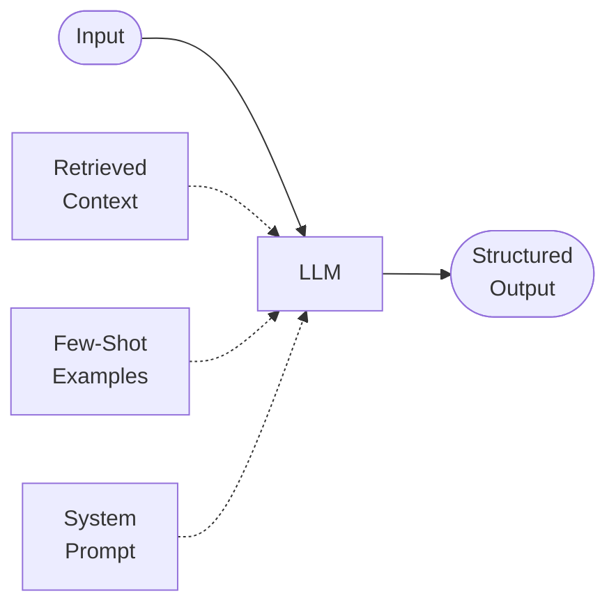
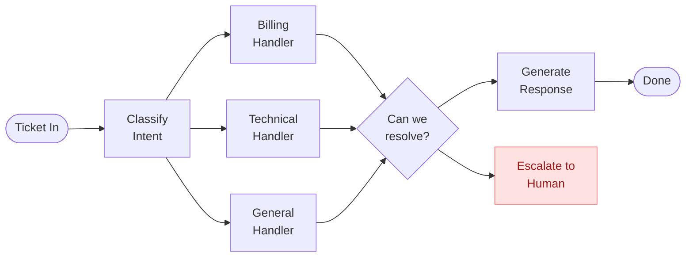
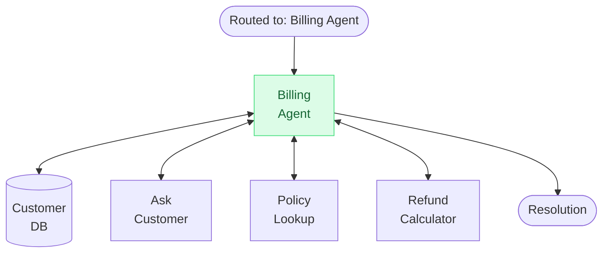
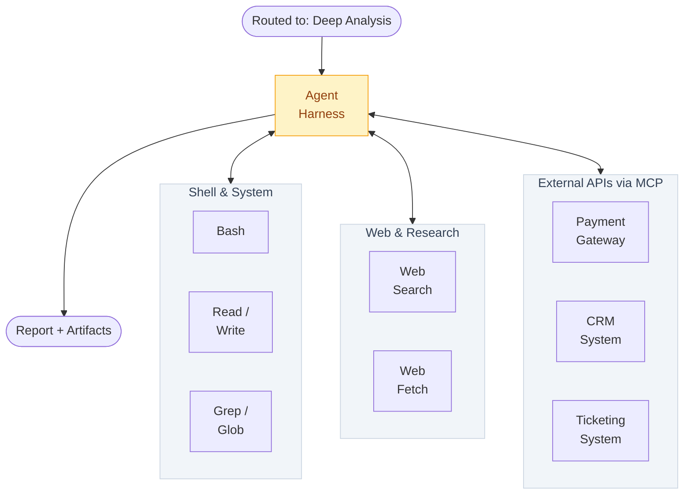
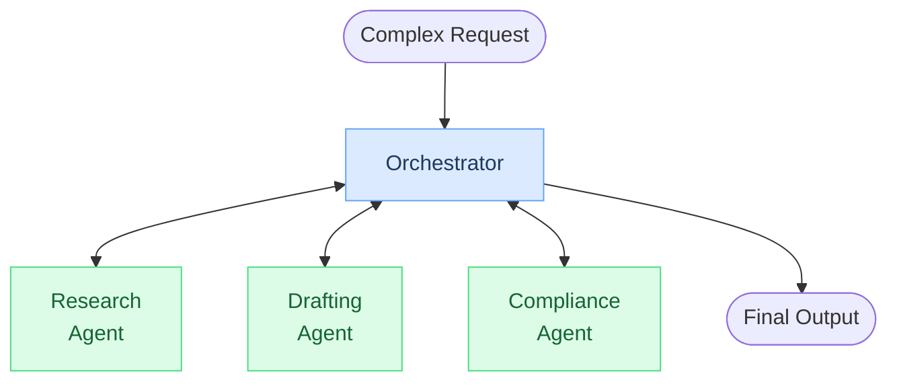
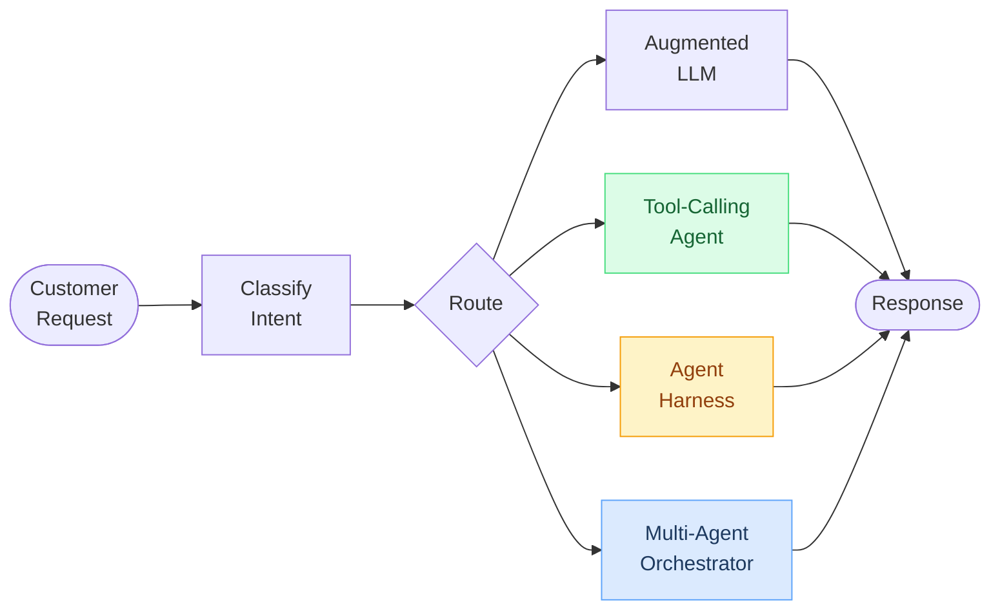

# 5 Levels of AI Agents Complexity

| Level | Pattern | Code |
|---|---|---|
| 1 | Augmented LLM | [`1-augmented-llm.py`](1-augmented-llm.py)|
| 2 | Prompt Chains & Routing | [`2-prompt-chains.py`](2-prompt-chains.py)|
| 3 | Tool-Calling Agent | [`3-tool-calling-agent.py`](3-tool-calling-agent.py)|
| 4 | Agent Harness | [`4-agent-harness.py`](4-agent-harness.py) |
| 5 | Multi-Agent Orchestration | [`5-multi-agent.py`](5-multi-agent.py) |

---

## Level 1: Augmented LLM - Single API Call

One model call with the right context: system prompt, few-shot examples, structured output, retrieval. No loops, no tools, no autonomy. This handles more than most people think.

---

## Level 2: Prompt Chains & Routing - Deterministic DAGs

Multiple LLM calls orchestrated through fixed paths. Each step validates its output before passing to the next. No model makes decisions about control flow - the code does.

---

## Level 3: Tool-Calling Agent - Scoped Autonomy

The agent decides which tools to call and in what order, but only within a fixed set of well-defined capabilities. This is where real autonomy starts.

---

## Level 4: Agent Harness - Full Runtime Access

Instead of hand-picking tools, you give the agent a full runtime - the same capabilities you see in coding agents like Claude Code or Cursor. Bash execution, file system access, grep and search, web research, external APIs. The agent reasons about what to do, executes, observes, and iterates autonomously.

---

## Level 5: Multi-Agent Orchestration - Delegated Autonomy

An orchestrator decomposes the task and delegates to specialized agents, each with their own tools, prompts, and (optionally) their own models. How delegation works depends on the architecture you choose:

- **Subagents (this example - Claude Agent SDK):** Each worker spins up in its own context window with its own system prompt and tools. It does its job independently and returns a result to the orchestrator. The orchestrator never sees the worker's internal reasoning - only the final output. This is how tools like Claude Code and Cursor handle it.
- **Passed-down agents (e.g. PydanticAI, LangGraph):** Instead of isolated subagents, you wire agents together in code - passing outputs from one to the next, sharing dependencies, or nesting agent calls. The control flow is more explicit and the context can be shared.

---

## The Full Picture: All Five Combined

The routing decision isn't about severity - it's about what the task *needs*. Each level trades off cost, latency, reliability, and capability differently. Use the simplest level that gets the job done.

| | Augmented LLM | Tool-Calling Agent | Agent Harness | Multi-Agent |
|---|---|---|---|---|
| **Cost** | $ | $$ | $$$ | $$$$ |
| **Latency** | ~1s | ~5s | ~30s+ | ~60s+ |
| **Reliability** | Deterministic | High | Medium | Lower |
| **When to use** | Answer is retrievable | Needs a few specific tools | Needs exploration and reasoning | Needs parallel domain expertise |
